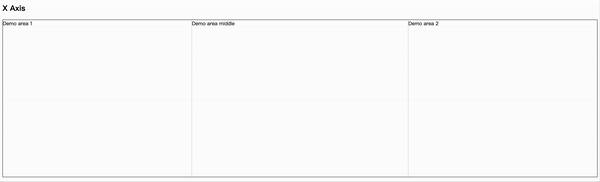
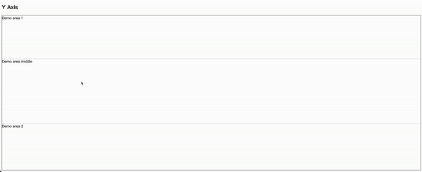

# vue3-adjust-panel
> Control your panel size with drag and resize





[Demo]()

## Install

```bash
$ npm install vue3-adjust-size
```

## Usage

```vue
<script setup lang="ts">
import { DragResizeDirection, useAdjustPanel } from 'vue3-adjust-panel';

const demoRef = ref<HTMLElement | null | undefined>(null);

useAdjustPanel(demoRef, {
  directions: DragResizeDirection.Right,
  persist: true,
  persistKey: 'resize-demo-x-1',
  minWidth: 300,
  maxWidth: 600,
  defaultWidth: 350,
})
</script>
<template>
  <div class="demo-area">
    <div ref="demoRef" class="demo-area-item">
      Demo area 1
    </div>
  </div>
</template>
<style scoped>
.demo-area {
  width: 100%;
  height: 500px;
  display: flex;
  margin-top: 20px;
  border: 1px solid black;
}
</style>
```


## Arguments
1. First argument is a ref of HTMLElement or HTMLElement
2. Second argument is an object with the following properties:


| Option            | Required       | Type                                                                                                      | Default        | Description                               |
|-------------------|----------------|-----------------------------------------------------------------------------------------------------------|----------------|-------------------------------------------|
| `directions`      | Yes            | `DragResizeDirection \| DragResizeDirection[] \| Ref<DragResizeDirection> \| Ref<DragResizeDirection[]>` | N/A            | Directions for resizing.                  |
| `defaultWidth`    | No             | `number \| null \| undefined \| Ref<number> \| Ref<null> \| Ref<undefined>`                               | `undefined`    | Default width of the element.             |
| `defaultHeight`   | No             | `number \| null \| undefined \| Ref<number> \| Ref<null> \| Ref<undefined>`                               | `undefined`    | Default height of the element.            |
| `minWidth`        | No             | `number \| null \| undefined \| Ref<number> \| Ref<null> \| Ref<undefined>`                               | `undefined`    | Minimum width of the element.             |
| `minHeight`       | No             | `number \| null \| undefined \| Ref<number> \| Ref<null> \| Ref<undefined>`                               | `undefined`    | Minimum height of the element.            |
| `maxWidth`        | No             | `number \| null \| undefined \| Ref<number> \| Ref<null> \| Ref<undefined>`                               | `undefined`    | Maximum width of the element.             |
| `maxHeight`       | No             | `number \| null \| undefined \| Ref<number> \| Ref<null> \| Ref<undefined>`                               | `undefined`    | Maximum height of the element.            |
| `barSize`         | No             | `number \| null \| undefined \| Ref<number> \| Ref<null> \| Ref<undefined>`                               | `5`            | Bar size, default is 5px.                 |
| `barIndex`        | No             | `number \| null \| undefined \| Ref<number> \| Ref<null> \| Ref<undefined>`                               | `0`            | Bar index, default is 0.                  |
| `persist`         | No             | `boolean`                                                                                                  | `false`        | Persist resizing information.             |
| `persistKey`      | Yes, if persist is true | `string`                                                                                                  | `undefined`    | Persist key, required if persist is true. |
| `storage`         | No             | `Storage`                                                                                                  | `localStorage` | Persist storage, default is localStorage. |
| `XAxisCursor`     | No             | `string \| null \| undefined \| Ref<string> \| Ref<null> \| Ref<undefined>`                               | `ew-resize`    | Cursor style for left and right bars.     |
| `YAxisCursor`     | No             | `string \| null \| undefined \| Ref<string> \| Ref<null> \| Ref<undefined>`                               | `ns-resize`    | Cursor style for top and bottom bars.     |
| `position`        | No             | `'absolute' \| 'relative' \| 'fixed' \| 'sticky' \| Ref<'absolute'> \| Ref<'relative'> \| Ref<'fixed'> \| Ref<'sticky'>` | `relative`     | Position of the element.                  |

## DragResizeDirection
| Value  | Description |
|--------|-------------|
| `Top`    | top         |
| `Right`  | right       |
| `Bottom` | bottom      |
| `Left`   | left        |